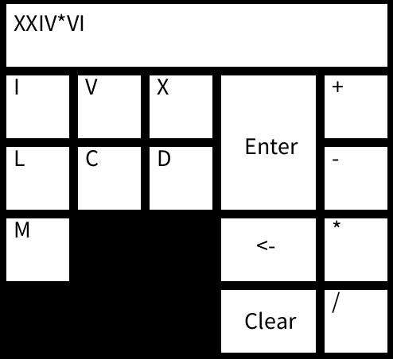
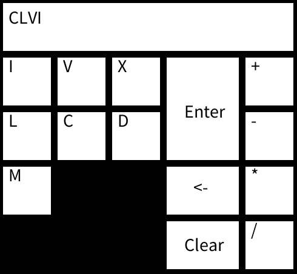

# Basic Roman Numeral Calculator
Simple Roman Numeral Calculator written in Processing. Supports input from interface and keyboard.
Current operations are: 
>Add
>Subtract
>Multiply
>Divide

### To do:
> Make it support multiple operations
> Make it resizable
> Make it support parentheses
> Better theming

## Example:

